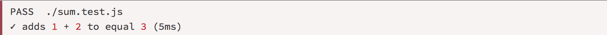

### what - 什么是单元测试？
> 单元测试（Unit Testing）又称为模块测试, 是针对程序模块（软件设计的最小单位）来进行正确性检验的测试工作。程序单元是应用的最小可测试部件。在过程化编程中，一个单元就是单个程序、函数、过程等；对于面向对象编程，最小单元就是方法，包括基类（超类）、抽象类、或者派生类（子类）中的方法。

### why - 为什么要单元测试？
> 单元测试的目标是隔离程序部件并证明这些单个部件是正确的。一个单元测试提供了代码片断需要满足的严密的书面规约，使得在软件开发过程的早期就能发现问题。

### how - 如何进行 RN 单元测试？
1. [Jest](https://facebook.github.io/jest/) 
2. [Enzyme](https://github.com/airbnb/enzyme) : for React
3. [Mocha](https://mochajs.org/) : JS only, 类似 Jest
4. [Flow](https://flow.org/) : JS only
6. RN 官方 native 组件 `RCTTestRunner`, `RCTTestModule`，只支持 IOS

***目前统计的以上测试工具着重研究了前 3 种工具。***

## Jest
> Easy Setup  
  Instant Feedback   
  Fast and sandboxed  
  Zero configuration   
  Powerful mocking library

### 基本用法
1. 写一个需要测试的单元，eg: 求和函数 sum

#### Jest 支持 `Babel`, `Webpack`, `TypeScript`, 只需进行相应的配置即可

2. 使用 Jest 写测试用例

#### 其中，`expect`, `toBe` 称为 `Matchers` , 可以看做是 Jest 的语法，更多信息看[这里](https://facebook.github.io/jest/docs/using-matchers.html)

3. 启动测试

#### 可以将测试命令写入 package.json 中, 通过 `npm run test`

#### 也可以直接在命令行中输入 Jest 命令进行测试

#### 对此，Jest 提供了很多配置，eg: 
+ 只测试 Git 中 还未提交的代码；
+ 测试特定名字或匹配某一正则表达式的文件；
+ 用不同颜色区分测试结果（同 webpack 的 `--colors` 配置）等等
+ 更多配置项，看[这里](https://facebook.github.io/jest/docs/cli.html)

4. 查看结果

### 测试 React(Native) Apps  - Snapshot Testing
> Snapshot tests are a very useful tool whenever you want to make sure your UI does not change unexpectedly.

#### Snapshot Testing 用于 UI 测试，检查一个 RN Component 渲染出的 UI 组件是否正确，测试过程大致同上：
1. 编写 RN Component
2. 编写测试用例
3. 启动测试
4. 生成测试结果：Snapshot File
5. 对比以前的 Snapshot File 与本次测试生成的 Snapshot File，若有差异，开发人员需自行判断这些变化是否是需要的，并且若差异是正确的、需要的，还需要将新的 Snapshot File 提交到 Git 以覆盖旧的 Snapshot File（Jest 命令：Jest -u）

## Enzyme
#### Enzyme 是 React 官方测试工具库的封装
#### 没错，Enzyme 是 React 的测试工具
#### 语法也是类似 Jest 的断言式语法，并且其 api 类似 jQuery 的 API 风格

### Enzyme 提供的测试方法
+ shallow: 将 React 组件渲染成 Virtual DOM 对象，但是只渲染第一层，不渲染子组件，因此处理速度快

#### 其中的 find 方法就是 Enzyme 提供的 api 之一，但是只支持简单的选择器，复杂的选择暂不支持

+ render: 将 React 组件渲染成静态 HTML 字符串，然后分析这段 HTML 代码的结构，返回一个对象。与 shallow 方法类似，不同之处在于是采用了第三方 HTML 解析库 [Cheerio](https://cheerio.js.org/)，因此返回的是一个 Cheerio 实例对象

+ mount: 将 React 组件加载为真实 DOM 节点进行测试

### 如何适用于 RN ？ 
### 答案：模拟！
### ***官方推荐 [react-native-mock](https://github.com/RealOrangeOne/react-native-mock)*** : 用 JS 写的 React Native
### 用法：
+ 正常编写 RN 组件
+ 正常编写测试用例（同 React 的测试用例）
+ 在测试时引入 react-native-mock/mock 文件夹下的入口文件，以引入假的 RN 库，应用将使用这个假的 RN 库代替真的 RN，以此进行 RN 组件的测试

## Mocha
#### JS 测试框架，能在浏览器和 Node 环境中运行
#### 其测试步骤和语法都与 Jest 的基本用法类似，但 mocha 自身不带断言库，因此需借助第三方断言库

#### 功能也与 Jest 类似
+ 提供了很多配置项提供了
+ 测试用例的钩子函数（数量不如 Jest 提供的多）
+ 支持 ES6 项目
+ 支持 Webpack 项目
+ 支持异步测试
+ 随不能进行 React / React Native Component 的测试，但可以与 Enzyme 结合进行 React / React Native 的测试
#### 具体可见[官网](https://mochajs.org/)

## Flow
> Code Faster  
  Code Smarter  
  Code Confidently  
  Code Bigger

### 基本用法：
#### 通过类型注释对 JS 代码提供静态类型检查

+ 通过 `@flow` 标志引入 flow
+ 使用类型注释来定义参数返回值类型，参数类型等等

#### 也可以是自定义的数据类型

#### 此时需要对 Action 数据类型进行定义

#### 按这种数据类型的定义，就能很好的适应对 reducer 的检测

### 运行时间：

#### 编译时检测，React Native packager 会自动移除这些，因此不会导致运行时的任何性能损失

### IDE 插件

+ Flow Language Support : for VSCode
+ VSCode-flow-ide : for VSCode
+ other editors, check [this](https://flow.org/en/docs/editors/)

## Nuclide

> Nuclide is built as a single package on top of Atom to provide hackability and the support of an active community. It provides a first-class development environment for React Native, Hack and Flow projects.

+ 集成在 Atom 内
+ 支持多语言：`Hack`, `Flow`, `OC`, `C++`, `JS`, `PHP`......
+ 支持多平台：`IOS`, `Android`, `Web`, `RN`
+ 运行时间：实时检测，eg: 搭配 Flow，能在控制台内实时看到类型检测是否通过
+ [for more information](https://nuclide.io/)

