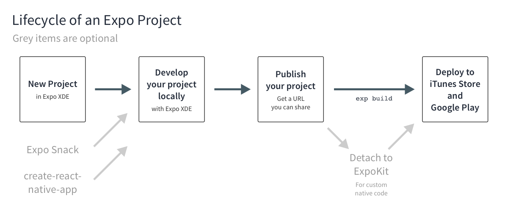
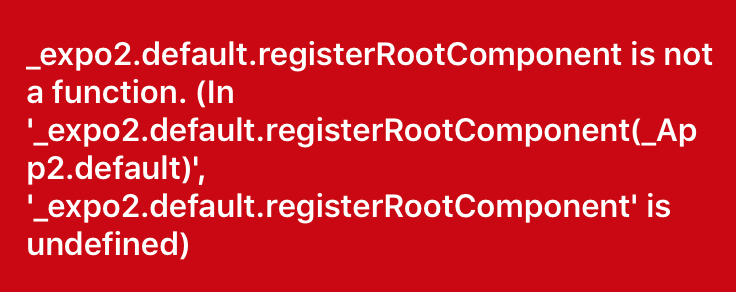

### 简介
> Expo is a set of tools, libraries and services which let you build native iOS and Android apps by writing JavaScript.  

- Expo provides a shared native runtime so you don’t write native code, you focus on writing your React app in JavaScript. 
- You don’t have to worry about iOS or Android specific settings, or even opening up Xcode. 
- Expo has its own workflow including an electron-based app called XDE and command line interface to make developing and deploying easy.

#### 详细工作原理，可以看这篇[文章](https://docs.expo.io/versions/latest/guides/how-expo-works.html)

### Expo SDK
+ a native-and-JS library: access to system functionality like camera, contacts, local storage, and other hardware
+ provides UI components
+ access to services
    + manage your Assets
    + take care of Push Notifications
    + build native binaries

### 开发所需
+ desktop development tool：XDE
+ mobile client：Expo for iOS and Android
    + Android 4.4
    + IOS 9.0

### lifecycle



### 开发步骤
1. Creating an Expo Project
2. Develop
3. Publishing: exp publish
4. Deploying: exp build:ios or exp build:android


### Expo vs. React Native
+ Support for iOS and Android
+ Push Notifications
+ Facebook Login
+ Instant Updating
+ Asset Management
+ Easier Updating To New React Native Releases


### custom native module
+ [ExpoKit](https://docs.expo.io/versions/latest/guides/expokit.html)

### app.json
app 的配置文件，类似 plist, xml

### some command line
+ `exp start -c --localhost --ios`
    - start expo server, clear cache, load only on localhost and open on iOS simulator
+ `exp start --tunnel`
    - start expo server (don’t clear cache) and run expo on a tunnel so you can share it with anyone
+ `exp send 2245551234`
    - send a link to a friend’s phone number so they can view on their phone exactly what I’m working on 


### what else ?
- The “React packager” is a simple HTTP server that compiles our app JavaScript code using Babel and serves it to the Expo app


## app.json
- 应用配置文件
- 根目录下（同package.json）
```js
{
  "expo": {
    // 必须项
    "name": "My app", // 应用名称
    "slug": "my-app", // publish时的名称
    "sdkVersion": "22.0.0",  // Expo sdk 版本，应保持与package.json中的依赖版本一致
    
    // 非必须项
    "description": "an expo experience", // 描述
    "privacy": "public", // public or unlisted
    "version": "0.0.1", // app 版本
    "orientation": "portrait", // 固定方向，默认不固定，可选值 portrait or landscape
    "icon": "local or remote path to icon", // app 图标，推荐尺寸 512x512
    "notification": { // Configuration for remote (push) notifications
        "icon": "",
        "color": "",
        "androidMode": "",
        "androidCollapsedTitle": ""
    }, 
    "loading": { // Configuration for the loading screen
        "icon": "",
        "exponentIconColor": "",
        "exponentIconGrayscale": "",
        "backgroundImage": "",
        "backgroundColor": "",
        "hideExponentText": ""
    },
    "appKey": "main", // 默认 main
    "androidStatusBar": { // Configuration for android statusbar
        "barStyle": "",
        "backgroundColor": ""
    },
    "entryPoint": "", // The relative path to your main JavaScript file
    "ios": { // IOS standalone app specific configuration
        "bundleIdentifier": "", // package name for ios app
        "buildNumber": "", 
        "icon": "", // ios app 图标，会覆盖上一级的icon设置
        "merchantId": "", 
        "config": {}, 
        "isRemoteJSEnabled": true, // 是否下载远程代码，默认true
        "supportsTablet": true, // 是否支持平板，默认false
        "isTabletOnly": false, // 是否只支持平板
        "infoPlist": false, // Dictionary of arbitrary configuration to add to your standalone app’s native Info.plist
        "associatedDomains": [],
        "splash": {, //Configuration for loading and splash screen
            "backgroundColor": "",
            "resizeMode": "",
            "image": "",
            "tabletImage": "",
        }
    }, 
    "android": { // android standalone app specific configuration
        "package": "", // package name for Android app
        "versionCode": "", 
        "icon": "", // ios app 图标，会覆盖上一级的icon设置
        "permissions": [], // 能使用的系统功能，eg：['CAMERA', 'RECORD_AUDIO']
        "config": {}, 
        "splash": {, //Configuration for loading and splash screen
            "backgroundColor": "",
            "resizeMode": "",
            "ldpi": "",
            "mdpi": "",
            "hdpi": "",
            "xhdpi": "",
            "xxhdpi": "",
            "xxxhdpi": "",
        }
    }
  }
}
```

## 命令行 command line
```js
npm install -g exp
```

#### 初次使用可能需要登陆expo，可以使用（`exp login`）

#### 常用命令行
+ `exp start -c --localhost --ios`
    - start expo server, clear cache, load only on localhost and open on iOS simulator
+ `exp start --tunnel`
    - start expo server (don’t clear cache) and run expo on a tunnel so you can share it with anyone
+ `exp send 2245551234`
    - send a link to a friend’s phone number so they can view on their phone exactly what I’m working on


## debug
基本同现在的调试方式
### debug 环境
- 真机
- 模拟器
    - ios simulator
    - android genymotion

### debug 菜单
- 真机：摇
- 模拟器
    - ios：cmd + d / ctrl-cmd-Z
    - Androi：cmd + m

### 设置
- 确保 host 类型为 lan 或是 localhost，以及调试模式处于打开的状态
- Debug JS Remotely

## 发布应用（publishing）
- XDE 里点击发布按钮
- 或使用`exp publish`

expo 会将代码打包成 ios 和 android 两个平台运行的代码，并上传到 cdn，生成一个可下载应用的 url，此后，只要发布，就能实时更新应用，除了以下的这些改动：

- Increment the Expo SDK Version
- Change anything under the ios or android keys
- Change your app splash
- Change your app icon
- Change your app name
- Change your app scheme
- Change your facebookScheme

以上这些改动，需重新 biuld 并提交 app store 以完成更新

## 发布应用到 app store
1. xde 内未集成，需安装 exp : `npm install -g exp`
2. 配置 app.json
```js
{
    "expo": {
        "name": "Your App Name",
        "icon": "./path/to/your/app-icon.png",
        "version": "1.0.0",
        "slug": "your-app-slug", // url name that app’s JavaScript is published to, eg: exp.host/@community/slug
        "sdkVersion": "17.0.0",
        /**
         * The iOS bundleIdentifier and Android package fields use reverse DNS notation,
         * but don’t have to be related to a domain.
         * Replace "com.yourcompany.yourappname" with whatever makes sense for your app
         */
        "ios": {
          "bundleIdentifier": "com.yourcompany.yourappname"
        },
        "android": {
          "package": "com.yourcompany.yourappname"
        }
    }
}
```
3. `exp start` 启动应用
4. `exp build:android` or `exp build:ios`, 会要求输入 appleId, password, apple Team Id 等信息
5. 使用 `exp build:status` 查看进度，完成后会生成url, 通过该url可下载 .apk 或是 .ipa 文件
6. 测试生成的 app
7. 提交 app store


## 链接
```js
// Anchor Component for RN
import { Linking, Text } from 'react-native';

export default class Anchor extends React.Component {
  _handlePress = () => {
    Linking.openURL(this.props.href);
    this.props.onPress && this.props.onPress();
  };

  render() {
    return (
      <Text {...this.props} onPress={this._handlePress}>
        {this.props.children}
      </Text>
    );
  }
}
```

```js
// opening a web link
import { Button, Linking, View } from 'react-native';
import { WebBrowser } from 'expo';

export default class App extends Component {
  render() {
    return (
      <View>
        <Button
          title="Open URL with ReactNative.Linking"
          onPress={this._handleOpenWithLinking}
        />
        <Button
          title="Open URL with Expo.WebBrowser"
          onPress={this._handleOpenWithWebBrowser}
        />
      </View>
    );
  }
  
  _handleOpenWithLinking = () => {
    Linking.openURL('https://expo.io');
  }
  
  _handleOpenWithWebBrowser = () => {
    WebBrowser.openBrowserAsync('https://expo.io');
  }
}
```

### Opening links to other apps
- lyft deep linking
- react-native-app-link

### Expo.Constants.linkingUri

## ExpoKit

> ExpoKit is an Objective-C and Java library that allows you to use the Expo platform and your existing Expo project as part of a larger standard native project

**不到万不得已，不建议使用**

### 步骤
1. `npm install -g exp`
2. [检查 app.json 的配置](https://docs.expo.io/versions/latest/guides/building-standalone-apps.html#2-configure-appjson)
3. `exp detach`: 下载并创建 ios or android 工程需要的东西

运行 native 工程后即可进行相关修改，以及发布应用，其中 js 部分的代码仍可以通过 expo 进行发布，但是原生相关的代码则必须自己管理

### 运行工程
1. 检查依赖
    1. react-native 的版本应该与 Expo 的 RN 版本一致
    2. 相关依赖已安装
2. 运行 expo 项目，xde 里 `restart` 或是执行 `exp start`
3. IOS：
    1. `pod install`
    2. 使用 xcode 打开 `xcworkspace`
    3. 使用 xcode build, run
4. Android：
    1. 使用 Android studio 打开 android 文件夹，build and run

### 后果：
1. control the native projects, including configuring and building them yourself
1. writing native code, manage Xcode and Android Studio projects
2. when React Native upgrades, need to figure them out for your particular situation
3. manage your own push notification pipeline

### 升级 ExpoKit
1. IOS:
    + Open up ios/Podfile in your project, and update the ExpoKit tag to point at the release corresponding to your SDK version. Re-run pod install
    + Open ios/your-project/Supporting/EXSDKVersions.plist in your project and change all the values to the new SDK version.
2. Android
    + Go to https://expo.io/—/api/v2/versions and find the androidExpoViewUrl key under sdkVersions.[NEW SDK VERSION].
    + Download that .tar.gz file and extract it.
    + Go to your project’s .expo-source/android directory and replace it with the android directory from the file you downloaded.
    + Go to MainActivity.java and replace Arrays.asList("[OLD SDK VERSION]") with Arrays.asList("[NEW SDK VERSION]").
    + Go to build.gradle and replace compile('host.exp.exponent:expoview:[OLD SDK VERSION]@aar') { with compile('host.exp.exponent:expoview:[NEW SDK VERSION]@aar') { 


## 实践
1. 根目录新建 package.json 文件

```json
{
  "name": "expo",
  "version": "0.0.1",
  "description": "Expo Test!",
  "author": "asyxu",
  "private": true,
  "main": "node_modules/expo/AppEntry.js",
  "dependencies": {
    "expo": "^22.0.0",
    "react": "16.0.0-beta.5",
    "react-native": "https://github.com/expo/react-native/archive/sdk-22.0.1.tar.gz",
    "react-navigation": "^1.0.0-beta.15"
  }
}
```

### 注意
- 入口文件 main 的设置为 "node_modules/expo/AppEntry.js"
- rn 版本是 expo fork 的一个 rn 分支 
- expo 的版本应与 app.json 里的 sdkVersion 项匹配

2. 根目录新建 app.json 文件, 暂时先只设置必须项

```json
{
  "expo": {
    "name": "expo",
    "slug": "expo",
    "sdkVersion": "22.0.0"
  }
}
```

3. 根目录新建 App.js 文件

```js
import React from 'react';
import { Text, View } from 'react-native';

export default class App extends React.Component {
	render() {
		return (
			<View>
				<Text>this is asy coding</Text>
			</View>
		);
  }
}
```

### 注意
看了下 `node_modules/expo/AppEntry.js` 文件的代码，只做了简单的类似 AppResigter 的工作，如下
：
```js
import Expo from 'expo';
import App from '../../App';

Expo.registerRootComponent(App);
```

PS: 这也是为什么 App.js 要求在项目根路径的原因

于是尝试将 package.json 的项目入口改为根目录下的 index.js, 即

```json
  "main": "./index.js",
```

而 index.js 的内容同 AppEntry.js 的内容一样，进行“注册”工作

```js
import Expo from 'expo';
import App from 'place to App’s root file';

Expo.registerRootComponent(App);
```

以期达到能够自主安放并命名项目文件的目的

#### 但是，这样是不行的，启动项目会报错



#### 所以还是使用 AppEntry.js 吧。。。

#### 2017.11.06 更新：是可以不使用 AppEntry.js 的写法的

4. run `npm install` or `yarn install` 安装依赖
5. 启动项目，初次启动项目会自动生成 .expo 的文件夹，里边有一些运行项目的配置信息
    1. 下载并安装 [xde](https://expo.io/tools), 使用 xde 打开项目
    2. `npm install exp -g` 然后通过命令行 `exp start` 启动，启动后控制台会打印出一个 URL，在 expo app 里打开这个 url 即可开发项目
6. 进行漫长的开发工作: 基本是把nsip-rn的代码copy过来的，修改的少数几个地方包括：
    1. 删除了 component 目录下 nativeUI，native 相关组件
    2. 删除了 page/ui 目录下的 textInput 示例，因其使用了 exitText
    3. 由于项目构建的关系，文件层级发生了变化，修改了某些文件的引用方式，如 TextArt/index.js Wedge 的引用从 `import Wedge from '../../../../component/ui/PieChat/Wedge'` 改为了 `import Wedge from '../../../component/ui/PieChat/Wedge'`
    4. 由于 expo 对资源有自己加载资源的一套规则，因此在使用时，eg icon 资源，都需要使用 expo 提供的方法（详见第7条），因此在使用 Icon 组件时，有稍微不同。  
    在 Icon 组件里新增了：

    ```js
    import { createIconSet } from '@expo/vector-icons'
    const glyphMap = require('../../../assets/FontAwesome.js').default;
    const ExpoIcon = createIconSet instanceof Function ? createIconSet(glyphMap, 'FontAwesome') : null;
    ```

    同时 修改了 render return

    ```js
    // old
    // return <Text {...props}>{glyph}{this.props.children}</Text>
	// new
	return ExpoIcon ? (
	    <ExpoIcon name={name} {...props} >
	        {this.props.children}
	    </ExpoIcon>
	) : (
	    <Text {...props}>{glyph}{this.props.children}</Text>
	)
    ```

    Icon 不用再调 setFamily 方法了
    5. 删除了手势密码 GesturePassword, 因为其测试页里使用 nativeModules.CustomUtils
7. 加载资源：
    1. 字体资源：Expo.Font.loadAsync()

    ```js
    componentDidMount() {
      Font.loadAsync({
       // This loads Open FontFamilyTTF and associates it with the name 'FontFamily' in Expo’s font map
        'FontFamily': require('./assets/fonts/FontFamilyTTF.ttf'),
      });
    } 
    ```

    2. icon 资源
        1. Expo 自带的 icon 图标库 @expo/vector-icons
        2. 自定义的图标库
        ```js
        // 先使用 Font.loadAsync 加载图标资源
        async componentDidMount() {
    		await Font.loadAsync({
    			'FontAwesome': require('./assets/FontAwesome.ttf')
    		})
    	}
    	
    	// 再创建图标库
    	// 使用 @expo/vector-icons 提供的 api
    	import { createIconSet } from '@expo/vector-icons'
    	// 图标 name 和 code 的映射关系表
        const glyphMap = require('../../../assets/FontAwesome.js').default;
        // 使用提供的 api 创建图标库
        const ExpoIcon = createIconSet(glyphMap, 'FontAwesome');
        
        // 使用
        <ExpoIcon name={name} {...props} >{this.props.children}</ExpoIcon>
        ```
    3. 其他资源同理，有相应的 assets.loadAsync 等方法
