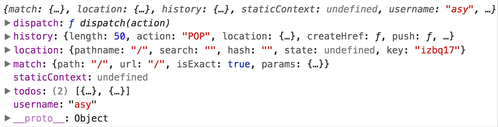
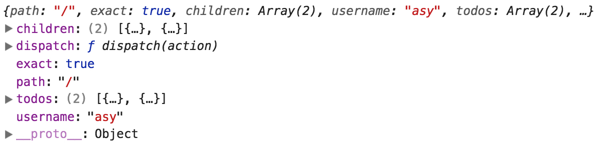
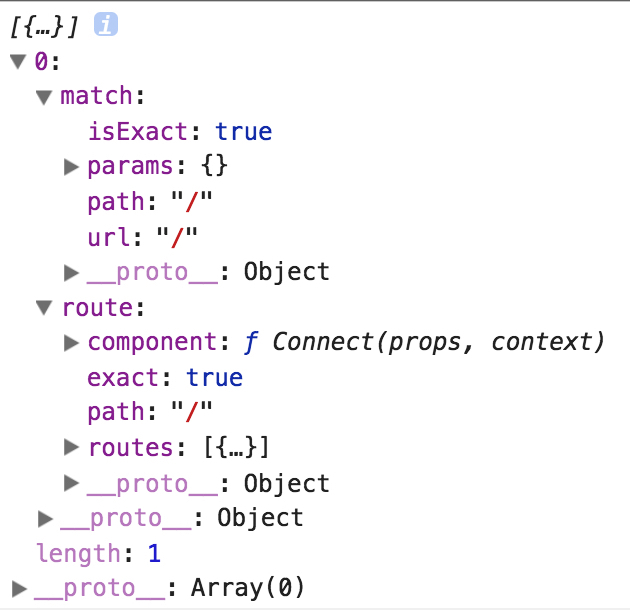

## 一、基本环境搭建

1. 安装 React

```bash
$ npm install --save react react-dom
```

2. 安装 less

```
$ npm install --save less
```

3. 安装 babel 相关

```bash
# 安装 babel
$ npm install --save babel-core
# 安装 react, es6 的转码器
$ npm install --save babel-preset-es2015 babel-preset-react babel-preset-stage-0
# 安装样式的加载器
$ npm install --save babel-loader css-loader style-loader less-loader
```

并配置 `.babelrc`

```json
{
  "presets": [
    "react", "es2015", "stage-0"
  ]
}
```

4. 安装 webpack

```bash
# 安装 webpack
$ npm install --save webpack webpack-dev-server html-webpack-plugin uglifyjs-webpack-plugin
# webpack4.0 以上版本还需安装 webpack-cli
$ npm install --save webpack-cli
# 安装 extract-text-webpack-plugin
$ npm install --save extract-text-webpack-plugin@next
```

**注意**

- 采用这种方式安装的 `extract-text-webpack-plugin` 与 webpack4.0 不兼容，会导致报错，需使用 @next 的方式进行安装；
- 引用方式保持不变，依然是 `require('extract-text-webpack-plugin')`。

```bash
$ npm install --save extract-text-webpack-plugin
```

5. 配置 webpack

```js
// webpack.config.js
const path = require('path');
const webpack = require('webpack');
const ExtractTextPlugin = require('extract-text-webpack-plugin');
const HtmlWebpackPlugin = require('html-webpack-plugin');
const UglifyJsPlugin = require('uglifyjs-webpack-plugin');

module.exports = {
  mode: 'development',
  entry: {
    vendor: ['react', 'react-dom'],
    index: path.resolve(__dirname, 'index.js'),
  },
  output: {
    path: path.resolve(__dirname, 'build'),
    filename: '[name].bundle.js',
  },
  module: {
    rules: [{
      test: /\.js$/,
      exclude: [
        path.resolve(__dirname, 'node_modules')
      ],
      use: [{
        loader: 'babel-loader',
      }],
    }]
  },
  resolve: {
    extensions: ['.js', '.jsx'],
  },
  optimization: {
    splitChunks: {
      cacheGroups: {
        commons: {
          test: /[\\/]node_modules[\\/]/,
          name: 'vendor',
          chunks: 'all',
        },
      },
    },
    minimizer: [
      new UglifyJsPlugin({
        cache: true,
        parallel: true,
        sourceMap: true
      })
    ]
  },
  plugins: [
    new ExtractTextPlugin({
      filename: '[name].[contenthash:8].css'
    }),
    new HtmlWebpackPlugin({
      template: './index.html'
    }),
    new webpack.HotModuleReplacementPlugin()
  ],
  devtool: 'source-map',
  devServer: {
    port: 3000,
    compress: true,
    historyApiFallback: true,
    proxy: {
      '/api/*': {
        target: 'http://127.0.0.1:3001',
        secure: false,
      }
    }
  }
}
```

```json
// package.json
"scripts": {
  "start": "webpack-dev-server --progress --profile --colors --hot --config webpack.config.js"
},
```

**注意 1 - plugin :**

webpack4.0 以后移除了 CommonsChunkPlugin 和 UglifyJsPlugin，因此以前的 plugin 写法不再适用：

```js
// 以前的写法，不再试用
module.exports = {
  plugins: [
    new webpack.optimize.CommonsChunkPlugin({
      name: 'vendor',
      filename: 'vendor-[hash].min.js',
    }),
    new webpack.optimize.UglifyJsPlugin({
      compress: {
        warnings: false,
        drop_console: false,
      }
    }),
  ]
}
```

按上述写法会报错：

```bash
webpack.optimize.CommonsChunkPlugin has been removed, please use config.optimization.splitChunks instead.
```

webpack4.0 的写法，[戳这里](https://github.com/yesvods/Blog/issues/15)：

```js
// 现在的写法，使用 optimization.splitChunks 和 optimization.minimizer 来代替
module.exports = {
  optimization: {
    splitChunks: {
      cacheGroups: {
        commons: {
          test: /[\\/]node_modules[\\/]/,
          name: 'vendor',
          chunks: 'all',
        },
      },
    },
    minimizer: [
      new UglifyJsPlugin({
        cache: true,
        parallel: true,
        sourceMap: true
      })
    ]
  }
}
```

**注意 2 - 关于启动热更新 :**

方法1：start 命令启用 `--hot` 参数

```json
"scripts": {
  "start": "webpack-dev-server --progress --profile --colors --hot --config webpack.config.js"
},
```

方法2：

```js
module.exports = {
  plugin: [
    new webpack.HotModuleReplacementPlugin()
  ]
  devServer: {
    port: 3000,
    compress: true,
    hot: true,
    historyApiFallback: true,
    proxy: {
      '/api/*': {
        target: 'http://127.0.0.1:3001',
        secure: false,
      }
    }
  }
}
```

一定要有 plugin 里的 `webpack.HotModuleReplacementPlugin()` 这个插件，仅仅在 devServer 里启用 `hot` 虽然编译会通过，但是浏览器控制台会报错：

```bash
Uncaught Error: [HMR] Hot Module Replacement is disabled.
```

更多见(官网解释](https://webpack.docschina.org/guides/hot-module-replacement)

至此，一个简单的单页应用就搭建完成了，假如有如下代码，打开浏览器应该能看到 “hello” 字样了：

```jsx
import React, { Component } from 'react';
import { render } from 'react-dom';

class App extends Component {
  render(){
    return <h1>hello</h1>
  }
}

render(<App />, document.getElementById("app"));
```

## 二、react-router

完成基本环境搭建后，使用 `react-router` 做页面路由

文档：
- [英文](https://reacttraining.com/react-router/web/guides/philosophy)
- [中文](https://segmentfault.com/a/1190000014294604)

### 安装

```bash
$ npm install --save react-router-dom
```

**注意：**

构建 web 应用时不用显示安装 `react-router`, 直接安装 `react-router-dom` 即可，具体见[笔记](http://note.youdao.com/noteshare?id=9ca2273bfc0cb41f20ec56228195d094)

### react-router-dom

简单来说，路由由三部分组成：
- Router
- Link
- Route

#### 1. Router

使用 Router 在顶层包裹应用：

```jsx
import { BrowserRouter } from 'react-router-dom';

render((
  <BrowserRouter>
    <App />
  </BrowserRouter>
), document.getElementById("app"));
```

#### 2. Link

使用 Link 作为 anchor：

```jsx
import { Link } from 'react-router-dom';

<Link to="/page1">to page 1</Link>
```

`<Link>` vs. `<NavLink>`:
> <NavLink>: A special version of the <Link> that will add styling attributes to the rendered element when it matches the current URL

```
// Link
<Link to="/">Home</Link>

// NavLink
<NavLink to="/" activeClassName="active">Home</NavLink>
```


#### 3. Route

指明 url 渲染的内容：

```jsx
import { Route } from 'react-router-dom';

<Route path="/page1" component={Page1} />
```

这样就算构建了一个基本的路由框架了，应用到前面的代码中：

```jsx
import React, { Component } from 'react';
import { render } from 'react-dom';
import { BrowserRouter, Link, Route } from 'react-router-dom';

class Page1 extends Component {
  render(){
    return <h1>page1</h1>
  }
}

class Page2 extends Component {
  render(){
    return <h1>page2</h1>
  }
}

class App extends Component {
  render(){
    return (
      <BrowserRouter>
        <div>
          <h1>hello</h1>
          <nav>
            <Link to="/page1">page1</Link>
            <Link to="/page2">page2</Link>
          </nav>
          <div>
            <Route path="/page1" component={Page1}></Route>
            <Route path="/page2" component={Page2}></Route>
          </div>
        </div>
      </BrowserRouter>
    )
  }
}

render(<App />, document.getElementById("app"));
```

下面附上嵌套路由的简单应用，需要注意的是 v4 以后嵌套路由的写法发生了改变。

以前的写法，通过 Route 的嵌套来实现路由嵌套：

```jsx
// index.js 
<BrowserRouter>
  <div>
    <Route path='/' exact component={Home}>
      <Route path="/page1" component={Page1}>
        <Route path="/sub1" component={Page1Sub1} />
        <Route path="/sub2" component={Page1Sub2} />
      </Route>
      <Route path="/page2" component={Page2} />
    </Route>
  </div>
</BrowserRouter>
```

在 react-router 升级到 v4 之后上述代码会在 chrome 控制台里报错，并且不能正确渲染出 page1、2 等页面

```
Warning: You should not use <Route component> and <Route children> in the same route; <Route children> will be ignored
```

v4 把路由也看成 react 组件，因此直接把通过组件的嵌套来实现路由嵌套

```jsx
// App.js
export default class App extends Component {
  render(){
    return (
      <BrowserRouter>
        <div>
          {/* 通过 <Home> 组件形式实现路由嵌套 */}
          <Home path="/" exact>
            <Route path="/page1" component={Page1} />
            <Route path="/page2" component={Page2} />
          </Home>
        </div>
      </BrowserRouter>
    )
  }
}

// home.js
export default class Home extends Component {
  render(){
    return (
      <div>
        <h1>home</h1>
        {/* 通过 this.props.children 接收子路由相关的信息 */}
        {this.props.children}
      </div>
    )
  }
}

// page1.js
export default class Page1 extends Component {
  render(){
    return (
      <div>
        <h1>page1</h1>
        <Route path="/page1/sub1" component={Page1Sub1} />
        <Route path="/page1/sub2" component={Page1Sub2} />
      </div>
    )
  }
}

// page2.js
export default class Page2 extends Component {
  render(){
    return <h1>page2</h1>
  }
}

// page1sub1.js
export default class Sub1 extends Component {
  render(){
    return <h1>sub1</h1>
  }
}
```

这样的结果是：
1. 访问 `/`，页面显示 `home`
2. 访问 `/page1`，页面显示 `home page1`
3. 访问 `/page2`，页面显示 `home page2`
4. 访问 `/page1/sub1`，页面显示 `home page1 sub1`
5. 访问 `/page1/sub2`，页面显示 `home page1 sub2`

### API

- `<BrowserRouter>`
- `<HashRouter>`
- `<Link>`
- `<NavLink>`
- `<Prompt>`
- `<Redirect>`
- `<Route>`
- `<Switch>`
- history
- match
- location
- matchPath
- withRouter

## 三、redux

### redux 三大原则

- 单一数据源
- State 是只读的
- 使用纯函数来执行修改

其中单一数据源指整个应用的 state 被储存在一棵 object tree 中，并且这个 object tree 只存在于唯一一个 store 中；state 是只读的意味着唯一改变 state 的方法就是触发 action（action 是一个用于描述已发生事件的普通对象）；使用春函数来执行修改则是说明了为了描述 action 如何改变 state tree ，需要编写 reducers；因此，store、action、reducer 共同组成了 Redux。

### 组成

- Action
- Reducer
- Store

### Action

> Action 是把数据从应用传到 store 的有效载荷，它是 store 数据的唯一来源。

```js
// action.js

// 定义 action 
export const ADD_TODO = 'ADD_TODO';

// 定义 action 创建函数，并约定 action 内必须使用一个字符串类型的 type 字段来表示将要执行的动作
export function addTodo(param) {
  return {
    type: ADD_TODO,
    payload: {
      text: param
    }
  }
}
```

Redux 中只需把 action 创建函数的结果传给 `dispatch()` 方法即可发起一次 dispatch 过程

```js
// page.js
store.dispatch(addTodo(text))
```

### Reducer

> Reducers 指定了应用状态的变化如何响应 actions 并发送到 store 的，记住 actions 只是描述了有事情发生了这一事实，并没有描述应用如何更新 state。

reducer 是一个`纯函数`，接收旧的 state 和 action，返回新的 state。

```js
// reducer.js
import { ADD_TODO } from 'action.js';

function todos(state = [], action) {
  switch (action.type) {
    case ADD_TODO: 
      return [...state, action.payload];
    case DEL_TODO:
      return ...;
    ...
    default:
      return state;
  }
}
```

随着应用的开发，reducer 会越来越大，还需要对各个 reducer 进行功能拆分，甚至拆分到不同的文件中，每个 reducer 只负责管理全局 state 中它负责的一部分。

Redux 提供了 `combineReducers()` api, `combineReducers()` 所做的只是生成一个函数，这个函数来调用你的一系列 reducer，每个 reducer 根据它们的 key 来筛选出 state 中的一部分数据并处理，然后这个生成的函数再将所有 reducer 的结果合并成一个大的对象。正如其他 reducers，如果 `combineReducers()` 中包含的所有 reducers 都没有更改 state，那么也就不会创建一个新的对象。

```js
// reducerAll.js
import { combineReducers } from 'redux';
import { todos, visibilityFilter } from 'recuder.js';

const todoApp = combineReducers({
  visibilityFilter,
  todos
})
```

### Store

Store 是联系 Action 和 Reducer 的对象，Redux 应用只有一个单一的 store。

#### 1. 创建 store - createStore(reducers, initialState)

```js
import { createStore } from 'redux';
import reducers from 'reducerAll.js';

const store = createStore(reducers);
```

`createStore(reducer, [preloadedState], enhancer)`:
- preloadedState: 初始时的 state。在同构应用中，你可以决定是否把服务端传来的 state 水合（hydrate）后传给它，或者从之前保存的用户会话中恢复一个传给它。如果你使用 combineReducers 创建 reducer，它必须是一个普通对象，与传入的 keys 保持同样的结构。否则，你可以自由传入任何 reducer 可理解的内容。

#### 2. 监听事件 - store.subscribe(listenerFunc)

subscribe 方法设置监听函数，一旦 State 发生变化，就自动执行这个函数

- 入参函数放入监听队列；
- 返回取消订阅函数；

```
function handleChange() {
  let previousValue = currentValue;
  currentValue = select(store.getState())
  if (previousValue !== currentValue) {
    // dosomething
  }
}

const unsubscribe = store.subscribe(handleChange)
// unsubscribe();
```

#### 3. 分发 action - store.dispatch(action)

- 调用 Reducer，传参（currentState，action）
- 按顺序执行 listener
- 返回 action


### api

- [createStore](http://cn.redux.js.org/docs/api/createStore.html)
- [Store](http://cn.redux.js.org/docs/api/Store.html)
- [combineReducers](http://cn.redux.js.org/docs/api/combineReducers.html)
- [applyMiddleware](http://cn.redux.js.org/docs/api/applyMiddleware.html)
- [bindActionCreators](http://cn.redux.js.org/docs/api/bindActionCreators.html)
- [compose](http://cn.redux.js.org/docs/api/compose.html)


## 四、react-redux

> Official React bindings for Redux.

react-redux 也成为 redux 绑定库，主要是用来在 React 环境中载入 Redux 的，因为本质上讲 Redux 和 React 之间没有关系，Redux 支持 React、Angular、Ember、jQuery 甚至纯 JavaScript。

### 安装 react-redux

```bash
$ npm install --save react-redux
```

react-redux 主要提供了两个 api：
- Provider
- connect

### Provider

> <Provider store> 使组件层级中的 connect() 方法都能够获得 Redux store。正常情况下，根组件应该嵌套在 <Provider> 中才能使用 connect() 方法。

```jsx
ReactDOM.render(
  <Provider store={store}>
    <MyRootComponent />
  </Provider>,
  rootEl
)

// 使用 react-router 的情况
ReactDOM.render(
  <Provider store={store}>
    <Router history={history}>
      <Route path="/" component={App}>
        <Route path="foo" component={Foo}/>
        <Route path="bar" component={Bar}/>
      </Route>
    </Router>
  </Provider>,
  document.getElementById('root')
)
```

### connect()

连接 React 组件与 Redux store

`connect([mapStateToProps], [mapDispatchToProps], [mergeProps], [options])`

- mapStateToProps(state, ownProps)：函数允许我们将 store 中的数据作为 props 绑定到组件上
- mapDispatchToProps(dispatch, ownProps)：函数允许将 action 作为 props 绑定到组件上。

用法：

```
// page.js
export default connect()(PageComponent)
```

### 实例

1. 按照 Redux 部分的说明创建 action, reducer 和 store，

```js
// action.js
export const ADD_TODO = "ADD_TODO";

export function addTodo(text) {
  return {
    type: ADD_TODO,
    payload: text
  }
}

// reducer.js
import { ADD_TODO } from './action';

export default function todo(state = [], action) {
  switch(action.type){
    case ADD_TODO:
      // 因为在 store.js 里给 state 初始值设置了 userinfo 和 todo，所以这里在更新 ADD 操作时只更新其中的 todo
      return {
        ...state,
        todo: [...state, action.payload]
      };
    default:
      return state;
  }
}

// store.js
import { createStore } from 'redux';
import { Provider } from 'react-redux';
import reducer from './reducer';

const store = createStore(reducer, {
  userinfo: {
    name: 'asy'
  },
  todo: [{
    text: 'reading book',
    complete: false
  }, {
    text: 'sleep early',
    complete: true
  }]
});

export default store;
```

2. 使用 react-redux 连接 react 应用和 redux

```jsx
// App.js
// 用 react-redux 提供的 Provider 对应用进行包裹，并提供创建的 store 作为 props 传给 Provider
import { Provider } from 'react-redux';
import store from './store';

export default class App extends Component {
  render(){
    return (
      <Provider store={store}>
        <BrowserRouter>
          ...
          <Home path="/" exact>
            <Route path="/page1" component={Page1} />
            <Route path="/page2" component={Page2} />
          </Home>
        </BrowserRouter>
      </Provider>
    )
  }
}
```

3. 将需要监听 store 变化的组件通过 connect() 连接到 redux store

```jsx
// Home.js
class Home extends Component {
  render(){
    return (
      <div>
        <h1>home</h1>
        {this.props.children}
        <h2>hello {this.props.username}</h2>
        <p>now we have {this.props.todos.length} todos</p>
      </div>
    )
  }
}
export default connect((state) => {
  return {
    username: state.userinfo.username,
    todos: state.todo
  }
})(Home);
```

如此就创建出了 redux 应用，可以统一管理和监听 state 的变化；若在浏览器里访问根路径，那么就会在浏览器里看见下面这些内容

```bash
home
hello asy
now we have 2 todos
```

### 疑问

当使用非嵌套路由时，页面路由正常

```jsx
// App.js 非嵌套路由
export default class App extends Component {
  render(){
    return (
      <Provider store={store}>
        <BrowserRouter>
          <Route path="/" exact component={Home} />
          <Route path="/page1" component={Page1} />
          <Route path="/page2" component={Page2} />
        </BrowserRouter>
      </Provider>
    )
  }
}
```

此时在 `Home.js` 中打印 `this.props` 可以看到 `dispatch`, `history`, `location`, `match` 等属性，如下：



但是当使用嵌套路由时：

```jsx
export default class App extends Component {
  render(){
    return (
      <Provider store={store}>
        <BrowserRouter>
          <Home path="/" exact>
            <Route path="/page1" component={Page1} />
            <Route path="/page2" component={Page2} />
          </Home>
        </BrowserRouter>
      </Provider>
    )
  }
}
```

再打印 `this.props` 得到的竟然是不用的 props，如下：



并且访问 `/page1`, `/page2` 这些子路由时，router 根本没有进行路由，页面内根本不会呈现 page1、page2 的内容

造成问题的原因不太清楚。。。但感觉像是经过 Provider 包裹后就只支持一级路由了？

解决方法是使用 [withRouter](https://github.com/ReactTraining/react-router/blob/master/packages/react-router/docs/api/withRouter.md)

```js
// 将上面的 Home.js 的导出组件用 withRouter 包裹即可
HomeWithRouter = withRouter(Home);
```

再看此时打印的 `this.props`, 相关的属性都在其中了：


当然了，这并非最优解决方案，只是引出 withRouter 而已。


## 五、Redux 优化

经过前面的步骤，已经建立起 `react-redux` 的框架了，但还只是 `redux` 很简单的应用，代码写得也很 low，实际项目往往很大很复杂，因此以上的代码有很多可以优化的点来让代码组织得更清楚，主要就是运用提供的 api.

### combineReducers

**reducer 就是一个纯函数，接收旧的 state 和 action，返回新的 state。**

当系统超级简单时当然可以只有一个 reducer，所以这样写是不会有什么问题的：

```js
// reducer.js
export default function todo(state = [], action) {
  switch(action.type){
    case ADD_TODO:
      return {
        // 维护其他状态不变，eg: userinfo
        ...state,
        // 更新 todo
        todo: [...state, action.payload]
      };
    default:
      return state;
  }
}

// store.js
import reducer from './reducer';
const store = createStore(reducer, {
  userinfo: {
    name: 'asy'
  },
  todo: []
});
console.log(store.getState()); // {userinfo: {name: 'asy'}， todo: []}
```

此时，`todo` 这个 reducer 访问到的是整个 store，所以在触发 `ADD_TODO` action 时返回的新 state 不但要更新 todo 还要保证其他数据不变；

当系统不断壮大后，肯定会产生不同的 reducer 维护着不同的状态，各个 reducer 只关心自己的数据，而不用关心 store 树中其他的数据，这些不同的 reducer 甚至会在项目不同的文件夹下，那么此时该如何管理呢？

答案当然就是 `combineReducers` 了。

```js
// reducer1.js
export defualt function todo(state = [], action) {
  switch(action.type) {
    case ADD_TODO:
      // todo Reducer 只对应 store 树的 todo 数据，因此 ADD 操作就可以直接往 todo 列表里 push 新的 TODO 项
      return [...state, {
        complete: false,
        id: Date.now(),
        text: action.payload
      }];
    case TOGGLE_TODO:
      let newState = state.concat();
      newState.forEach(todo => {
        if (todo.id === action.payload) {
          todo.complete = !todo.complete;
        }
      });
      return newState
    default:
      return state;
  }
}

// reducer2.js
export default function updateUserInfo(state = {}, action) {
  switch(action.type) {
    case UPDATE_USERINFO:
      return action.payload;
    default:
      return state;
  }
}

// reducer.js
// 实际情况是 reducer1/2.js 导出的可能依然是经过 combineReducers() 返回的函数。
import todo from 'reducer1.js';
import updateUserInfo from 'reducer2.js';

export default combineReducers({
  todo,
  userinfo: updateUserInfo
});

// store.js 再直接引用最终的 reducer
import Reducer from 'reducer.js';

const store = createStore(...);
```

redux store 建立的树的节点其实是根据 reducers 的属性来建立的，这样一个独立的 reducer 只对应的 store 树里对应的数据，这就是 `combineReducers()` 的作用。

### bindActionCreators

有了 store, action, reducer 之后，在业务代码里怎么发起 action 从而更新 state 呢？

#### 方法1：this.props.dispatch 

经过 provider 包裹的应用，如果页面组件通过 `connect()` 连接了 redux, 那么在组件内部是可以拿到 dispatch 函数的（这个 dispatch 应该是属于 Store 实例的 dispatch 吧？）

```jsx
// Home.js
import { ToggleTodo, updateUserInfo } from '../store/action';

class Home extends Component {
  componentDidMount() {
    // 通过 this.props 获取 dispatch，dispatch 的参数是 action 函数的执行结果
    // 模拟用户登陆，更新用户信息
    this.props.dispatch(updateUserInfo({
      username: 'asy',
      userid: Date.now()
    }));
  }
  add = () => {
    this.props.dispatch(addTodo(this.refs.ipt.value));
  }
  render(){
    return (
      <div>
        <h1>home</h1>
        {this.props.children}
        <input type="text" ref="ipt" />
        <input type="button" onClick={this.add} value="添加" />
        <h2>hello {this.props.username}</h2>
        <p>now we have {this.props.todo.length} todos</p>
      </div>
    )
  }
}

export default connect((state) => {
  return {
    username: state.userinfo.username,
    todo: state.todo
  }
})(Home);
```

#### 方法2：mapDispatchToProps

利用 `connect()` 的第二个参数 matchDispatchToProps, 将 action 作为 props 绑定到组件上。

```js
// Home.js
import { updateUserInfo } from 'action.js';

export default connect((state) => {
  return {
    username: state.userinfo.username,
    todo: state.todo
  }
}, (dispatch) => {
  return {
    updateUserInfo: (...args) => dispatch(updateUserInfo(...args));
  }
  // 或者
  return {
    updateUserInfo: bindActionCreators(updateUserInfo, dispatch)
  }
})(Home);

class Home extends Component {
  componentDidMount() {
    // 直接发起 action
    this.props.updateUserInfo({
      username: 'asy',
      userid: Date.now()
    });
  }
  render(){
  ...
  }
}

// 也可以一次性绑定全部 action
import * as actions from 'action.js';

export default connect((state) => {
  return {
    username: state.userinfo.username,
    todo: state.todo
  }
}, (dispatch) => {
  return {
    actions: bindActionCreators(actions, dispatch)
  }
})(Home);

// 或是绑定部分
import { updateUserInfo， addTodo } from 'action.js';

export default connect((state) => {
  return {
    username: state.userinfo.username,
    todo: state.todo
  }
}, (dispatch) => {
  return {
    actions: bindActionCreators({
      updateUserInfo,
      addTodo
    }, dispatch)
  }
})(Home);

// 使用
this.props.actions.updateUserInfo({
  username: 'asy',
  userid: Date.now()
});
```

这就是 redux 提供的 api **bindActionCreators(actionCreators, dispatch)**

> 把一个 value 为不同 action creator 的对象，转成拥有同名 key 的对象。同时使用 dispatch 对每个 action creator 进行包装，以便可以直接调用它们。

> 一般情况下你可以直接在 Store 实例上调用 dispatch。如果你在 React 中使用 Redux，react-redux 会提供 dispatch 函数让你直接调用它 。

> 惟一会使用到 bindActionCreators 的场景是当你需要把 action creator 往下传到一个组件上，却不想让这个组件觉察到 Redux 的存在，而且不希望把 dispatch 或 Redux store 传给它。

其中：
- actionCreators：一个 action creator，或者一个 value 是 action creator 的对象
- dispatch: 一个由 Store 实例提供的 dispatch 函数

上面的写法需要在每个组件 export 的时候都写一遍 mapDispatchToProps, 还有一种更简洁的写法，例如：

```js
// store.js
import { bindActionCreators } from 'redux';
import action from 'action.js';

export const actionWrappedWithDispatch = bindActionCreators(actions, store.dispatch);
```

在业务组件里使用

```
// Home.js
import { actionWrappedWithDispatch } from '../store/store';

actionWrappedWithDispatch.updateUserInfo({
  username: 'asy',
  userid: Date.now()
});

actionWrappedWithDispatch.addTodo(this.refs.ipt.value);
```


## 六、React-Router-Config 优化

```jsx
// 一般路由
<BrowserRouter>
  <nav>
    <Link to="/page1">page1</Link>
    <Link to="/page2">page2</Link>
  </nav>
  <div>
    <Route path="/page1" component={Page1}></Route>
    <Route path="/page2" component={Page2}></Route>
  </div>
</BrowserRouter>


// 嵌套路由
<BrowserRouter>
  <div>
    {/* 通过 <Home> 组件形式实现路由嵌套 */}
    <Home path="/" exact>
      <Route path="/page1" component={Page1} />
      <Route path="/page2" component={Page2} />
    </Home>
  </div>
</BrowserRouter>
```

以上是之前的路由写法。

在实际项目中往往有很多路由信息，如果都这样写的话会导致代码结构不够清楚、可维护性也比较差。

更优的做法是使用单独的路由表来管理系统的路由信息，而在项目中使用这些路由表并渲染出相应的页面。

然后，dangdangdang~~react-router-config 来了

### react-router-config

> Static route configuration helpers for React Router.

简单来说，`react-router-config` 就是用来让我们可以通过配置文件的方式来配置路由，官方仓库在[这里](https://github.com/ReactTraining/react-router/tree/master/packages/react-router-config)

### motivation

```bash
With the introduction of React Router v4, there is no longer a centralized route configuration. There are some use-cases where it is valuable to know about all the app's potential routes such as:

1. Loading data on the server or in the lifecycle before rendering the next screen
2. Linking to routes by name
3. Static analysis

This project seeks to define a shared format for others to build patterns on top of.
```

### 安装

```
$ npm install --save react-router-config
$ npm install --save react-router
```

需要注意的是，`react-router-config` 依赖的是 `react-router`，不安装的话将会导致报错。所以即使在 web 项目中可以直接安装 `react-router-dom` 而不需要安装 `react-router`，但如果需要使用 `react-router-config` 的话还是需要安装 `react-router` 的。

```
ERROR in ./node_modules/react-router-config/es/renderRoutes.js
Module not found: Error: Can't resolve 'react-router/Route' in '/Users/yantao/Desktop/react-all/node_modules/react-router-config/es'
 @ ./node_modules/react-router-config/es/renderRoutes.js 5:0-39 13:33-38
 @ ./node_modules/react-router-config/es/index.js
 @ ./App.js
 @ ./index.js
 @ multi (webpack)-dev-server/client?http://localhost:3000 webpack/hot/dev-server ./index.js
```

### 用法

路由都是对象，同 `React-Router` 部分介绍的 `Route` 的用法类似，区别在于:

1. 路由对象不再接受 `render` 或是 `children` 属性，而是只有一个 `component` 属性；
2. 子路由用 `routes` 属性表示；
3. 开发者可以自定义路由对象的其他属性，并在页面中通过 `this.props.route` 获取相关信息；
4. 还可以给路由对象添加 `key` 属性，以及来避免重新挂载
> accepts key prop to prevent remounting component when transition was made from route with the same component and same key prop

示例：

```js
// routes.js
// 这里将 /page1, /page2 都不是根路径的子路由，与之前的设计稍微不用，不要搞混了
import Home from './Home/index';

export default [{
  path: '/',
  exact: true,
  // 写法 1
  component: Home,
}, {
  path: '/page1',
  // 写法 2
  component: () => import('./Page1/index'),
  // 引入子路由表
  routes: require('./Page1/routes').default,
}, {
  path: '/page2',
  // 写法 3
  component: require('./Page2/index').default,
}];
```

还可以由嵌套路由，比如 `/page1` 的子路由 `/page1/sub1`, `/page1/sub2`，此时为了方便管理，可以在 `Page1` 文件夹下再建一个路由文件，再在上面的路由表中引入这个子路由表：

```js
// Page1/routes.js
export default [{
  path: '/page1',
  component: () => import('./index'),
  routes: [{
    path: '/page1/sub1',
    component: () => import('./Sub1'),
  }, {
    path: '/page1/sub2',
    component: () => import('./Sub2'),
  }]
}]
```

### API

- matchRoutes(routes, pathname)
- renderRoutes(routes, extraProps = {}, switchProps = {})

#### `matchRoutes(routes, pathname)`
- routes: 路由配置表
- pathname: url 的 pathname

```
import { matchRoutes } from 'react-router-config';

const curRoute = matchRoutes(routes, '/');
console.log(curRoute);
```

此时如果访问根路径 `/`，可以在控制台看到以下信息：



matchRoutes 的返回值是一个数组，数组都的每一项都有 match 和 route 两个值，其中 match 就是匹配的路由项，可以通过 `match.url`, `match.isExact` 等获取相关匹配信息；route 是用于匹配的路由项（这部分解释还是看GitHub上的说明吧）。

#### `renderRoutes(routes, extraProps = {}, switchProps = {})`

> n order to ensure that matching outside of render with matchRoutes and inside of render result in the same branch, you must use renderRoutes instead of <Route> inside your components. 

使用 react-router-config 之后必须使用 renderRoutes 来代替此前的写法 `<Route path="/page1" component={Page1} />`。

其中，参数 `routes` 是一个数组，数组的项是路由信息, 类似 `matchRoutes` 的第一个参数：

```js
// 参数 routes
[{
  path: 'xxxx',
  component: SomeComponent,
  ...
}]
```

**需要注意的是 component 属性值必须是一个 class 实例，在下面的改造中将会看到。**

### 改造开始

下面就开始进行代码改造吧，改造前的代码可以在此前的章节中看到，改造的着重点在于读取路由文件 `routes.js` 并用 `renderRoutes` 生成路由代替 `<Route path="/page1" component={Page1} />`：

**PS:**
暂时只针对非嵌套路由的改造，嵌套路由还不是很懂该怎么做

#### Router.js

```js
// Router.js
// 要做的事情就是读取路由表，再调用 renderRoutes 生成 <Route />

import { Component } from 'react';
import { withRouter } from 'react-router';
import { matchRoutes, renderRoutes } from 'react-router-config';

class Router extends Component {
  constructor(props) {
    super(props);
    this.state = {
      route: props.initialRoute
    }
  }
  componentDidMount() {
    // 根据初始 url 渲染出对应页面
    this.match(this.props.location);
  }
  componentWillReceiveProps({ location }) {
    // 根据变化后的 url 渲染出对应页面
    if (location !== this.props.location) {
      this.match(location);
    }
  }
  match(location) {
    // 使用 matchRoutes 找到当前 url 匹配的路由项，返回结果是一个数组
    const curRoute = matchRoutes(this.props.routes, location.pathname)
    // 过滤出 isExact 为 true 的项
      .filter(route => route.match.isExact)
    // 由于 matchRoutes 里的每一项都有 match 和 route 两个属性，而renderRoutes 只需要其中路由相关的信息，因此挑选出 route 属性
      .map(route => route.route)[0];
    // 某些时候会有多个项匹配当前 url, 此时只需取一个项即可
    
    // 此时的 curRoute 是一个路由项，他可能长如下模样：
    // {
    //   path: 'xxx',
    //   component: xxx
    // }

    if (curRoute && curRoute.component) {
      // 判断 curRoute.component 的类型，
      // 此时的 curRoute.component 是类实例，对应于写法 1：component: Home 和写法3：component: require('./Page2/index').default
      if (this.isComponent(curRoute.component)) {
        this.updateRoute(curRoute);
      // } else if (this.isFunction(curRoute.component)) {
      } else {
      // 此时的 curRoute.component 是函数，对应于写法 2：component: () => import('./Page1/index'),
      // 由于 renderRoutes 参数的 component 属性必须是 class 实例，如果写成写法 2 的样子是会报错的
      // 因此需要先执行 component 函数使其返回页面 component 的 class 实例
        curRoute.component().then(comp => {
          // 此时的 comp.default 就是页面 component 了 
          curRoute.component = comp.default ? comp.default : comp;
          this.updateRoute(curRoute);
        })
      }
    }
  }
  isComponent(comp) {
    return comp && comp.prototype instanceof Component;
  }
  updateRoute(route) {
    this.setState({
      route,
    })
  }
  render() {
    // state 维护的是路由对象，而 renderRoutes 需要的参数是数组
    return renderRoutes([this.state.route]);
  }
}
// 最后为了一次性解决前面提到的 withRouter 的问题，可以直接在这里导出使用 withRouter 包装的 Router 组件，一劳永逸
export default withRouter(Router);
```

#### 思路：

1. 该组件接收路由表(数组)和当前路由(对象)，并用当前路由初始化 state；
2. react-router 里的页面组件都能通过 `this.props.location` 获取当前的 url 信息，`match` 所做的事情就是根据当前的 url 信息渲染出对应的页面；
3. match 函数找到当前的 url 匹配的页面，并最终通过 setState 更新状态，进入重新渲染。

#### 使用：

在此前代码的基础上，只需修改 App.js 即可

```
// App.js
import routes from './routes';
import Router from './Router.js';

export default class App extends Component {
  render(){
    // 找到初始路由对象
    const curRoute = matchRoutes(routes, window.location.pathname)
      .filter(route => route.match.isExact)
      .map(route => route.route)[0];

    return (
      <Provider store={store}>
        <BrowserRouter>
          <Router routes={routes} initialRoute={curRoute} />
        </BrowserRouter>
      </Provider>
    )
  }
}
```

### 问题
虽然前面提到了引入 component 的三种写法，但在子路由中的第二种函数写法却会导致报错，只能采用另外两种写法

```js
export default [{
  path: '/page1',
  routes: [{
    path: '/page1/sub1',
    // component: () => import('./Sub1'),
    component: require('./Sub2').default,
  }]
}]
```

报错原因也是看不懂。。。

```
GET http://localhost:3000/page1/3.bundle.js 404 (Not Found)
Refused to execute script from 'http://localhost:3000/page1/3.bundle.js' because its MIME type ('text/html') is not executable, and strict MIME type checking is enabled.
Uncaught (in promise) Error: Loading chunk 3 failed.
(error: http://localhost:3000/page1/3.bundle.js)
    at HTMLScriptElement.onScriptComplete (bootstrap:826)
```

但其实是有现成的项目这么写而正常运行的，所以肯定是哪里没弄对，这个问题有待解决。

## 七、history

[项目地址](https://www.npmjs.com/package/history)

在介绍 `React-Router-Redux` 之前，先来了解下 `hisroty`

> history is a JavaScript library that lets you easily manage session history anywhere JavaScript runs. history abstracts away the differences in various environments and provides a minimal API that lets you manage the history stack, navigate, confirm navigation, and persist state between sessions.

### api

- `createBrowserHistory`
- `createMemoryHistory`
- `createHashHistory`

### 使用

以 `createBrowserHistory` 为例：

```
import { createBrowserHistory } from 'history';
const history = createBrowserHistory(config);
```

### 属性

- history.length
- history.location
    - history.location.pathname
    - history.location.search
    - history.location.hash
    - history.location.state
    - history.location.key
- history.action

### 导航

- history.push(path, [state])
- history.replace(path, [state])
- history.go()
- history.goBack()
- history.goForward()

```
history.push('/home');

history.push('/home?the=query', { some: 'state' });

history.push({
  pathname: '/home',
  search: '?the=query',
  state: { some: 'state' }
})
```

## 八、React-Router-Redux

通过此前的介绍，我们已经知道了使用 redux 来进行应用状态(state)的管理，而使用 react-router 来进行路由的管理；但是根据官方的意思，当页面 url 也是状态时，通过 redux 改变相应的 url state，而 url 的改变按理说应该导致页面的变化，但是貌似由于 redux 和 react-router 并不能协同合作，使得当有类似需求时就会出现问题。

于是 `react-router-redux` 应运而生来协调这两个库。

> The library simply enhances a history instance to allow it to synchronize any changes it receives into application state.
c
`react-router-redux` 通过使用 history 来同步应用状态，当然也就包含了状态中的 URL：

```
history + store -> react-router-redux -> enhangced history -> react-router
```

**注意：**
由于 react-router 4.x 的改版, react-router 4.x 以及 react-router 2.x/3.x 对应的 `react-router-redux` 也是不一样的，适用于 react-router 4.x 的 react-router-redux 文档[戳这里](https://github.com/ReactTraining/react-router/tree/master/packages/react-router-redux)

### 安装

```
$ npm install --save react-router-redux@next
$ npm install --save history
```

### api

- ConnectedRouter
- routerReducer
- history
- push
- routerMiddleware


### 实例

1. 创建 history;

```js
import { createBrowserHistory } from 'history';

const history = createBrowserHistory();
```

2. 使用 `ConnectedRouter` 代替 `BrowserRouter` 连接 store 和 router, 并传入 history;

```js
// App.js
import { ConnectedRouter } from 'react-router-redux';

export default class App extends Component {
  render(){
    const curRoute = matchRoutes(routes, window.location.pathname).filter(route => route.match.isExact).map(route => route.route)[0];

    return (
      <Provider store={store}>
        {/* ConnectedRouter 代替了 BrowserRouter */}
        <ConnectedRouter history={history}>
          {/* 这里的 Router 实际上是使用 react-router-config 配置后我们自己实现的 Router.js */}
          <Router routes={routes} initialRoute={curRoute} />
        </ConnectedRouter>
      </Provider>
    )
  }
}
```

3. 在创建 store 的时候将 react-router-redux 提供的 routerReducer 作为 reducer 传入 createStore 函数

```js
// store.js
import { routerReducer } from 'react-router-redux';

const store = createStore(
  combineReducers({
    core: reducer,
    router: routerReducer
  }), 
  // 实际应用中 preloadstate 或者说是 initialState 通过都不这么写的，这里只是个示例
  { core: {} }
);
```

这样就算是建立了 url、store、pageComponent 之间的联系了，也是实际应用中的做法，但貌似使用上少了些，在什么地方用的上再看吧。

### combineReducers

上面的例子中，需要注意的一下 combineReducers 的用法。

`combineReducers` 的参数是对象，对象的 key 对应于 store 里的 key, 对象的 value **必须是 reducer 函数**

比如在 reducer.js 中的导出，其中 todo, updateUserInfo 都是 reducer 纯函数：

```js
// reducer.js， 
export default combineReducers({
  todo,
  userinfo: updateUserInfo
})
```

而 createStore 的第一个 reducer 参数的写法也影响着 preloadstate 的写法和在页面中 mapStateToProps 中对 state 的取值方式，因为这些都与唯一的那颗 store 树有着一一对应的管理，下面列举一些例子：

```
// 写法 1
1. const store = createStore(
2.   combineReducers({
3.     ...reducer
4.   }), {}
5. );

// 写法 2
 const store = createStore(
  combineReducers({
    reducer
  }), {}
);

// 写法 3
const store = createStore(
  combineReducers({
    core: reducer,
    router: routerReducer
  }), {
    todo: [],
    userinfo: {}
  }
);
```

#### 分析：

1. 写法 1：

直接报错：

```
Store does not have a valid reducer. Make sure the argument passed to combineReducers is an object whose values are reducers
```

尝试打印了一下 reducer.js 的输出(也就是上面 line 3 的 reducer)，是一个 combineReducers 函数...估计是因为这样，导致了使用 `...` 运算符之后 line 2 中 combineReducers 函数的参数对象的值不是一个 reducer 纯函数了，因此报错；

2. 写法 2：

相当于就是 

```
combineReducers({
  reducer: reducer
})
```

对应的取值方式：

```
export default connect((state) => {
  return {
    todo: state.reducer.todo
  }
})(Home);
```

3. 写法 3：报错

```
Unexpected keys "todo", "userinfo" found in preloadedState argument passed to createStore. Expected to find one of the known reducer keys instead: "core", "router". Unexpected keys will be ignored.
```

原因就在于前面提到的 preloadstate 的 key 需要与 reducer 的 key 保持一致，改成下面这样就 ok 了。

```
const store = createStore(
  combineReducers({
    core: reducer,
    router: routerReducer
  }), {
    core: {
      todo: [],
      userinfo: {}
    }
  }
);
```

## 九、最后的疑问

其实，到目前为止，我们构建的项目都只能访问根路径，如果直接访问 eg: `/page1` 控制台是会报错的：

```
GET http://localhost:3000/page1/vendor.bundle.js 404 (Not Found)
Refused to execute script from 'http://localhost:3000/page1/vendor.bundle.js' because its MIME type ('text/html') is not executable, and strict MIME type checking is enabled.
GET http://localhost:3000/page1/index.bundle.js 404 (Not Found)
Refused to execute script from 'http://localhost:3000/page1/index.bundle.js' because its MIME type ('text/html') is not executable, and strict MIME type checking is enabled.
```
