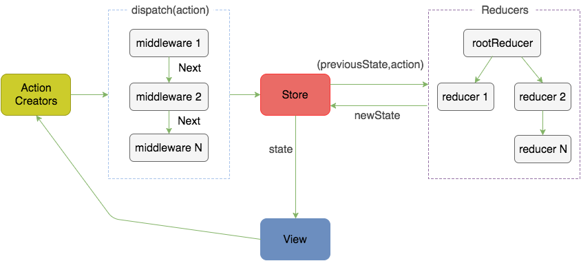
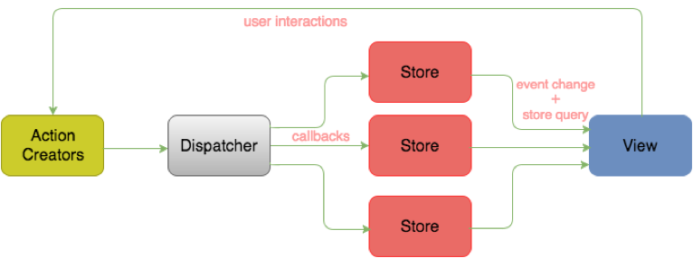

简单梳理下 redux 自身的知识，不涉及 react-redux，react-router-redux 等等。

中文文档看[这里](http://cn.redux.js.org/index.html)

## redux 是什么？

Javascript 状态容器，能提供可预测化的状态管理：

- web 应用是一个状态机，view 与 state 一一对应；
- 所有的状态，都保存在一个对象里面

## redux 三大原则

- 单一数据源
- State 是只读的
- 使用纯函数来执行修改

其中单一数据源指整个应用的 state 被储存在一棵 object tree 中，并且这个 object tree 只存在于唯一一个 store 中；state 是只读的意味着唯一改变 state 的方法就是触发 action（action 是一个用于描述已发生事件的普通对象）；使用春函数来执行修改则是说明了为了描述 action 如何改变 state tree ，需要编写 reducers；因此，store、action、reducer 共同组成了 Redux。

由此能够看到 redux 的工作流程：
1. 用户（通过 View）发出 Action，发出方式就用到了 dispatch 方法
2. Store 自动调用 Reducer，并且传入两个参数：当前 State 和收到的 Action，Reducer 会返回新的 State
3. State一旦有变化，Store就会调用监听函数，来更新View



## Flux 追溯

Flux 的最大特点就是数据的“单向流动”。Flux 是一种架构思想，在 Flux 里数据总是“单向流动”，任何相邻的部分都不会发生数据的“双向流动”，这保证了流程的清晰。

Flux 的工作流程如下：

1. 用户访问 View
2. View 发出用户的 Action
3. Dispatcher 收到 Action，要求 Store 进行相应的更新
4. Store 更新后，发出一个 “change” 事件



从上面 redux 和 flux 的工作流程可以看出 redux 和 flux 的区别在于：

1. Redux 只有一个 Store：

Flux 里面会有多个 Store 存储应用数据，并在 Store 里面执行更新逻辑，当 Store 变化的时候再通知 controller-view 更新自己的数据；

Redux 将各个 Store 整合成一个完整的 Store，并且可以根据这个 Store 推导出应用完整的 State，同时 Redux 中更新的逻辑也不在 Store 中执行而是放在 Reducer 中。

单一 Store 带来的好处是，所有数据结果集中化，操作时的便利，只要把它传给最外层组件，那么内层组件就不需要维持 State，全部经父级由 props 往下传即可。子组件变得异常简单。

2. Redux中没有Dispatcher的概念：

Redux 去除了 Dispatcher，使用 Store 的 Store.dispatch() 方法来把 action 传给 Store，由于所有的 action 处理都会经过这个 Store.dispatch() 方法，Redux 聪明地利用这一点，实现了与 Koa、RubyRack 类似的 Middleware 机制。Middleware 可以让你在 dispatch action 后，到达 Store 前这一段拦截并插入代码，可以任意操作 action 和 Store。很容易实现灵活的日志打印、错误收集、API 请求、路由等操作。

## 组成

- Action
- Reducer
- Store

### Action

> Action 是把数据从应用传到 store 的有效载荷，它是 store 数据的唯一来源。

```js
// action.js

// 定义 action 
export const ADD_TODO = 'ADD_TODO';

// 定义 action creator，并约定 action 内必须使用一个字符串类型的 type 字段来表示将要执行的动作
export function addTodo(param) {
  return {
    type: ADD_TODO,
    payload: {
      text: param
    }
  }
}
```

Redux 中只需把 action creator 的结果传给 `dispatch()` 方法即可发起一次 dispatch 过程

```js
// page.js
store.dispatch(addTodo(text))
```

### Reducer

> Reducers 指定了应用状态的变化如何响应 actions 并发送到 store 的，记住 actions 只是描述了有事情发生了这一事实，并没有描述应用如何更新 state。

reducer 是一个`纯函数`，接收旧的 state 和 action，返回新的 state。

```js
// reducer.js
import { ADD_TODO } from 'action.js';

function todos(state = [], action) {
  switch (action.type) {
    case ADD_TODO: 
      return [...state, action.payload];
    case DEL_TODO:
      return ...;
    ...
    default:
      return state;
  }
}
```

随着应用的开发，reducer 会越来越大，还需要对各个 reducer 进行功能拆分，甚至拆分到不同的文件中，每个 reducer 只负责管理全局 state 中它负责的一部分。

Redux 提供了 `combineReducers()` api 将所有 reducer 的结果合并成一个大的对象，后面会讲解这个 api.

```js
// reducerAll.js
import { combineReducers } from 'redux';
import { todos, visibilityFilter } from 'recuder.js';

const todoApp = combineReducers({
  visibilityFilter,
  todos
})
```

### Store

Store 是联系 Action 和 Reducer 的对象，Redux 应用只有一个单一的 store。

#### 1. 创建 store - createStore(reducers, initialState)

```js
import { createStore } from 'redux';
import reducers from 'reducerAll.js';

const store = createStore(reducers);
```

`createStore(reducer, [preloadedState], enhancer)`:
- preloadedState: 初始时的 state。在同构应用中，你可以决定是否把服务端传来的 state 水合（hydrate）后传给它，或者从之前保存的用户会话中恢复一个传给它。如果你使用 combineReducers 创建 reducer，它必须是一个普通对象，与传入的 keys 保持同样的结构。否则，你可以自由传入任何 reducer 可理解的内容。


源码解读：

```js
// reudx/createStore.js
export default function createStore(reducer, preloadedState, enhancer) {
  if (typeof preloadedState === 'function' && typeof enhancer === 'undefined') {
    enhancer = preloadedState
    preloadedState = undefined
  }

  if (typeof enhancer !== 'undefined') {
    if (typeof enhancer !== 'function') {
      throw new Error('Expected the enhancer to be a function.')
    }

    return enhancer(createStore)(reducer, preloadedState)
  }

  if (typeof reducer !== 'function') {
    throw new Error('Expected the reducer to be a function.')
  }

  let currentReducer = reducer
  let currentState = preloadedState
  let currentListeners = []
  let nextListeners = currentListeners
  let isDispatching = false

  function ensureCanMutateNextListeners() {}
  function getState() {
    return currentState
  }
  function subscribe(listener) {}
  function dispatch(action) {}
  function replaceReducer(nextReducer) {}
  function observable() {}

  // 用于生成初始 state 树
  dispatch({ type: ActionTypes.INIT })

  return {
    dispatch,
    subscribe,
    getState,
    replaceReducer,
    [$$observable]: observable
  }
}
```

createStore 最终返回一个 store 对象，该对象有 dispatch、subscribe、getState 等方法；

#### 2. 监听事件 - store.subscribe(listenerFunc)

源码：

```js
function subscribe(listener) {
  if (typeof listener !== 'function') {
    throw new Error('Expected the listener to be a function.')
  }

  if (isDispatching) {
    throw new Error(...)
  }

  let isSubscribed = true

  ensureCanMutateNextListeners()
  nextListeners.push(listener)

  return function unsubscribe() {
    if (!isSubscribed) {
      return
    }

    if (isDispatching) {
      throw new Error(...)
    }

    isSubscribed = false

    ensureCanMutateNextListeners()
    const index = nextListeners.indexOf(listener)
    nextListeners.splice(index, 1)
  }
}
```

subscribe 方法设置监听函数，一旦 State 发生变化，就自动执行这个函数

- 入参函数放入监听队列；
- 返回取消订阅函数；

```js
// 使用
function handleChange() {
  let previousValue = currentValue;
  currentValue = select(store.getState())
  if (previousValue !== currentValue) {
    // dosomething
  }
}

const unsubscribe = store.subscribe(handleChange)
// unsubscribe();
```

#### 3. 分发 action - store.dispatch(action)

```js
function dispatch(action) {
  if (!isPlainObject(action)) {
    throw new Error(...)
  }

  if (typeof action.type === 'undefined') {
    throw new Error(...)
  }

  if (isDispatching) {
    throw new Error('Reducers may not dispatch actions.')
  }

  try {
    isDispatching = true
    currentState = currentReducer(currentState, action)
  } finally {
    isDispatching = false
  }

  const listeners = (currentListeners = nextListeners)
  for (let i = 0; i < listeners.length; i++) {
    const listener = listeners[i]
    listener()
  }

  return action
}
```

- 调用 Reducer，传参（currentState，action）
- 按顺序执行 listener
- 返回 action


## API

- [createStore](http://cn.redux.js.org/docs/api/createStore.html)
- [Store](http://cn.redux.js.org/docs/api/Store.html)
- [combineReducers](http://cn.redux.js.org/docs/api/combineReducers.html)
- [applyMiddleware](http://cn.redux.js.org/docs/api/applyMiddleware.html)
- [bindActionCreators](http://cn.redux.js.org/docs/api/bindActionCreators.html)
- [compose](http://cn.redux.js.org/docs/api/compose.html)
 


### combineReducers

**reducer 就是一个纯函数，接收旧的 state 和 action，返回新的 state。**

当系统超级简单时当然可以只有一个 reducer，所以这样写是不会有什么问题的：

```js
// reducer.js
export default function todo(state = [], action) {
  switch(action.type){
    case ADD_TODO:
      return {
        // 维护其他状态不变，eg: userinfo
        ...state,
        // 更新 todo
        todo: [...state, action.payload]
      };
    default:
      return state;
  }
}

// store.js
import reducer from './reducer';
const store = createStore(reducer, {
  userinfo: {
    name: 'asy'
  },
  todo: []
});
console.log(store.getState()); // {userinfo: {name: 'asy'}， todo: []}
```

此时，`todo` 这个 reducer 访问到的是整个 store，所以在触发 `ADD_TODO` action 时返回的新 state 不但要更新 todo 还要保证其他数据不变；

当系统不断壮大后，肯定会产生不同的 reducer 维护着不同的状态，各个 reducer 只关心自己的数据，而不用关心 store 树中其他的数据，这些不同的 reducer 甚至会在项目不同的文件夹下，那么此时该如何管理呢？

答案当然就是用 `combineReducers` 来合并 reducer 了。

Redux 提供了 `combineReducers()` api, `combineReducers()` 所做的只是生成一个函数，这个函数来调用你的一系列 reducer，每个 reducer 根据它们的 key 来筛选出 state 中的一部分数据并处理，然后这个生成的函数再将所有 reducer 的结果合并成一个大的对象。

正如其他 reducers，如果 `combineReducers()` 中包含的所有 reducers 都没有更改 state，那么也就不会创建一个新的对象。


```js
// reducer1.js
export defualt function todo(state = [], action) {
  switch(action.type) {
    case ADD_TODO:
      // todo Reducer 只对应 store 树的 todo 数据，因此 ADD 操作就可以直接往 todo 列表里 push 新的 TODO 项
      return [...state, {
        complete: false,
        id: Date.now(),
        text: action.payload
      }];
    case TOGGLE_TODO:
      let newState = state.concat();
      newState.forEach(todo => {
        if (todo.id === action.payload) {
          todo.complete = !todo.complete;
        }
      });
      return newState
    default:
      return state;
  }
}

// reducer2.js
export default function updateUserInfo(state = {}, action) {
  switch(action.type) {
    case UPDATE_USERINFO:
      return action.payload;
    default:
      return state;
  }
}

// reducer.js
// 实际情况 reducer1/2.js 导出的可能依然是经过 combineReducers() 返回的函数。
import todo from 'reducer1.js';
import updateUserInfo from 'reducer2.js';

export default combineReducers({
  todo,
  userinfo: updateUserInfo
});

// store.js 再直接引用最终的 reducer
import Reducer from 'reducer.js';

const store = createStore(...);
```

redux store 建立的树的节点其实是根据 reducers 的属性来建立的，这样一个独立的 reducer 只对应的 store 树里对应的数据，这就是 `combineReducers()` 的作用。

### bindActionCreators(actionCreators, dispatch)

- actionCreators：一个 action creator，或者一个 value 是 action creator 的对象
- dispatch: 一个由 Store 实例提供的 dispatch 函数

有了 store, action, reducer 之后，在业务代码里怎么发起 action 从而更新 state 呢？

#### 方法1：this.props.dispatch 

经过 provider 包裹的应用，如果页面组件通过 `connect()` 连接了 redux, 那么在组件内部是可以拿到 dispatch 函数的（这个 dispatch 应该是属于 Store 实例的 dispatch 吧？）

```jsx
// Home.js
import { ToggleTodo, updateUserInfo } from '../store/action';

class Home extends Component {
  componentDidMount() {
    // 通过 this.props 获取 dispatch，dispatch 的参数是 action 函数的执行结果
    // 模拟用户登陆，更新用户信息
    this.props.dispatch(updateUserInfo({
      username: 'asy',
      userid: Date.now()
    }));
  }
  render(){
    return (
    )
  }
}

export default connect((state) => {
  return {
    username: state.userinfo.username,
    todo: state.todo
  }
})(Home);
```

#### 方法2：mapDispatchToProps

利用 `connect()` 的第二个参数 matchDispatchToProps, 将 action 作为 props 绑定到组件上。

```js
// Home.js
import { updateUserInfo } from 'action.js';

export default connect((state) => {
  return {
    username: state.userinfo.username,
    todo: state.todo
  }
}, (dispatch) => {
  return {
    updateUserInfo: (...args) => dispatch(updateUserInfo(...args));
  }
})(Home);

// 使用
this.props.updateUserInfo({
  username: 'asy',
  userid: Date.now()
});
```

#### 方法3：bindActionCreators

把一个 value 为不同 action creator 的对象，转成拥有同名 key 的对象。同时使用 dispatch 对每个 action creator 进行包装，以便可以直接调用它们。

```js
// Home.js
import { updateUserInfo } from 'action.js';

export default connect((state) => {
  return {...}
}, (dispatch) => {
  return {
    // way 1
    updateUserInfo: bindActionCreators(updateUserInfo, dispatch)
  }
})(Home);

// 使用
this.props.updateUserInfo({
  username: 'asy',
  userid: Date.now()
});

// 也可以一次性绑定全部 action
import * as actions from 'action.js';

export default connect((state) => {
  return {...}
}, (dispatch) => {
  return {
    // way 2
    actions: bindActionCreators(actions, dispatch)
  }
})(Home);

// 或是绑定部分
import { updateUserInfo， addTodo } from 'action.js';

export default connect((state) => {
  return {
    username: state.userinfo.username,
    todo: state.todo
  }
}, (dispatch) => {
  return {
    // way 3
    actions: bindActionCreators({
      updateUserInfo,
      addTodo
    }, dispatch)
  }
})(Home);

// 使用
this.props.actions.updateUserInfo({
  username: 'asy',
  userid: Date.now()
});
```

> 一般情况下你可以直接在 Store 实例上调用 dispatch。如果你在 React 中使用 Redux，react-redux 会提供 dispatch 函数让你直接调用它 。

> 惟一会使用到 bindActionCreators 的场景是当你需要把 action creator 往下传到一个组件上，却不想让这个组件觉察到 Redux 的存在，而且不希望把 dispatch 或 Redux store 传给它。


上面的写法需要在每个组件 export 的时候都写一遍 mapDispatchToProps, 还有一种更简洁的写法，例如：

```js
// store.js
import { bindActionCreators } from 'redux';
import action from 'action.js';

export const actionWrappedWithDispatch = bindActionCreators(actions, store.dispatch);
```

在业务组件里使用

```js
// Home.js
import { actionWrappedWithDispatch } from '../store/store';

actionWrappedWithDispatch.updateUserInfo({
  username: 'asy',
  userid: Date.now()
});

actionWrappedWithDispatch.addTodo(this.refs.ipt.value);
```

### compose

compose 这个方法主要用来组合传入的一系列函数，在中间件时会用到，其执行的最终结果是把各个函数串联起来。

源码：

```js
// redux/compose.js
export default function compose(...funcs) {
  if (funcs.length === 0) {
    return arg => arg
  }

  if (funcs.length === 1) {
    return funcs[0]
  }

  return funcs.reduce((a, b) => (...args) => a(b(...args)))
}
```

```js
compose(a, b, c)
// 等价于
return (...args) => a(b(c(...args)));
```

### applyMiddleware

redux 中间件，应该是比较难的一部分，之所以说比较难，是因为平时的工作中很少真正的去写中间件或者使用中间件，对他的了解比较少，下面就来解开 redux 中间件的面纱吧。

> 使用包含自定义功能的 middleware 来扩展 Redux 是一种推荐的方式。Middleware 可以让你包装 store 的 dispatch 方法来达到你想要的目的。同时， middleware 还拥有“可组合”这一关键特性。多个 middleware 可以被组合到一起使用，形成 middleware 链。其中，每个 middleware 都不需要关心链中它前后的 middleware 的任何信息。

在前面 createStore.js 的源码中能看到下面的代码：

```js
// redux/createStore.js
export default function createStore(reducer, preloadedState, enhancer) {
  if (typeof preloadedState === 'function' && typeof enhancer === 'undefined') {
    enhancer = preloadedState
    preloadedState = undefined
  }

  if (typeof enhancer !== 'undefined') {
    if (typeof enhancer !== 'function') {
      throw new Error('Expected the enhancer to be a function.')
    }

    return enhancer(createStore)(reducer, preloadedState)
  }
  ...
}
```

这实际上对应了 createStore 的两种语法：

```js
const store = createStore(reducer,applyMiddleware(…middlewares));
// or
const store = createStore(reducer,{},applyMiddleware(…middlewares));
```

最终, 当创建 store 传入了中间件时，相当于执行了

```js
enhancer(createStore)(reducer, preloadedState)
```

也即是：

```js
applyMiddleware(…middlewares)(createStore)(reducer,preloadedState)
```

再来看下 applyMiddleware 的源码：

```js
// redux/applyMiddleware.js
export default function applyMiddleware(...middlewares) {
  return createStore => (...args) => {
    const store = createStore(...args)
    let dispatch = () => {
      throw new Error(...)
    }

    const middlewareAPI = {
      getState: store.getState,
      dispatch: (...args) => dispatch(...args)
    }
    const chain = middlewares.map(middleware => middleware(middlewareAPI))
    dispatch = compose(...chain)(store.dispatch)

    return {
      ...store,
      dispatch
    }
  }
}
```

因此，对于带中间件的 store 创建的过程分析下：

1. `createStore(reducer,applyMiddleware(…middlewares));` 最终变成 `applyMiddleware(…middlewares)(createStore)(reducer,preloadedState)`;

2. `applyMiddleware()` 函数的执行返回一个函数 f1，f1 接受一个参数 createStore;
3. `f1(createStore)` 的执行返回一个函数 f2, f2 接受一些参数，f2 的函数体就是上面从 `const store = ...` 到最后 `return { ...store}` 的代码段；
4. 最后，`f2(reducer,preloadedState)` 执行；
5. 最终 `createStore(reducer,applyMiddleware(…middlewares));` 变成了执行下面的代码

```js
const store = createStore(reducer,preloadedState)
let dispatch = () => {
  throw new Error(...)
}
// 感觉 dispatch 应该是这个吧？
// let dispatch = store.dispatch;

const middlewareAPI = {
  getState: store.getState,
  dispatch: (...args) => dispatch(...args)
}

const chain = middlewares.map(middleware => middleware(middlewareAPI))
dispatch = compose(...chain)(store.dispatch)

return {
  ...store,
  dispatch
}
```

其中关键点在于这两句：

```js
const chain = middlewares.map(middleware => middleware(middlewareAPI))
dispatch = compose(...chain)(store.dispatch)
```

假设现在有两个中间件 m1、m2:

1. 由 `middlewares.map(middleware => middleware(middlewareAPI))` 可知，中间件应该是一个接收 `{getState, dispatch}` 的函数：

```js
// 中间件
({getState, dispatch}) => {
  return function r1() {}
}
```

因此 chain 应该是一个由 r1 函数组成的数组，暂记为 `[r11, r12]` 

2. 由于 `compose(...chain)(store.dispatch)` 相当于 `r11(r12(store.dispatch))`，由此可知 r1 函数接收的参数应该是 dispatch

```js
// 中间件
({getState, dispatch}) => {
  return (dispatch) => {
    return function r2() {}  
  }
}
```

3. 当在 store 实例上调用 dispatch 方法 `store.dispatch(someAction)` 时:

```js
store.dispatch(someAction)
// 等同于
compose(...chain)(store.dispatch)(someAction)
// 等同于
r11(r12(store.dispatch))(someAction)
// 为简化便于理解，将上面例子先简化为只有一个中间件时，相当于
r1(store.dispatch)(someAction)
```

由此可知 r1 函数接受 dispatch 为参数，函数执行后返回的函数 r2 函数应该接收 action 作为参数，也即：

```js
// 中间件
({getState, dispatch}) => {
  return (dispatch) => {
    return (action) => {
      // codes
    }  
  }
}
```

`store.dispatch(someAction)` 等同于执行上面注释 codes 部分的代码，由于这始终是一个发起 action 的指令，因此函数体内也应该执行发起 action 的代码，也即调用 dispatch 方法，最后得到中间件的代码如下：

```js
// 中间件
({getState, dispatch}) => {
  return (dispatch) => {
    return (action) => {
      dispatch(action);
    }  
  }
}
```

4. 下面再来考虑多个中间件的情况：

```js
r11(r12(store.dispatch))(someAction)
// 先把 r12(store.dispatch) 当做一个整体看成 r11 的参数，那么上面代码等同于
r12(store.dispatch)(someAction)
```

可以看见上面的逻辑同样使用于有多个中间件的情况，由此可以推导出通用的中间件的写法：

```js
// 中间件工厂的写法
function middleware() {
  return ({getState, dispatch}) => {
    return (dispatch) => {
      return (action) => {
        return dispatch(action);
      }  
    }
  }
}
```

再应用 es6 箭头函数的语法，可以精简如下：

```js
function middleware() {
  return ({getState, dispatch}) => next => action => next(action)
}
```

看下 redux-thunk 的源码：

```js
function createThunkMiddleware(extraArgument) {
  return ({ dispatch, getState }) => next => action => {
    if (typeof action === 'function') {
      return action(dispatch, getState, extraArgument);
    }

    return next(action);
  };
}

const thunk = createThunkMiddleware();

export default thunk;
```

是不是就是刚刚分析出来的模式？

最后再附上一个简单的 log 中间件的例子：

```js
// logMiddleware.js
function log({ getState }) {
  return next => action => {
    console.log('will dispatch', action)
    let returnValue = next(action)
    console.log('state after dispatch', getState())
    return returnValue
  }
}

// 使用
import log from 'logMiddleware.js'
let store = createStore(reducers, applyMiddleware(log))
```

也可以写成工厂的形式:

```js
// logMiddleware.js
function log() {
  return ({ getState }) {
    return next => action => {
      console.log('will dispatch', action)
      let returnValue = next(action)
      console.log('state after dispatch', getState())
      return returnValue
    }
  }
}

// 使用
import logCreator from 'logMiddleware.js';
const log = logCreator();
let store = createStore(reducers, applyMiddleware(log))
```

## 异步操作

redux 异步操作与同步操作的区别在于同步操作只要发出一种 Action 即可，异步操作的差别是它要发出三种 Action（至少三种 action, 至少发送两次 action）：
- 一种通知 reducer 请求开始的 action
- 一种通知 reducer 请求成功的 action
- 一种通知 reducer 请求失败的 action

因此需定义三种 action, 例如：

```js
// 发起请求
{ type: 'FETCH_POSTS_REQUEST' }
// 请求结束-请求成功
{ type: 'FETCH_POSTS_FAILURE', error: 'Oops' }
// 请求结束-请求失败
{ type: 'FETCH_POSTS_SUCCESS', response: { ... } }

// 或者
{ type: 'FETCH_POSTS' }
{ type: 'FETCH_POSTS', status: 'error', error: 'Oops' }
{ type: 'FETCH_POSTS', status: 'success', response: { ... } }
```

对应的 state 也需要有相应的属性对应不同的状态:

```js
let state = {
  // 请求中
  isFetching: true,
  // 数据是否过程
  didInvalidate: true,
  // 上次更新
  lastUpdated: 'xxxxxxx'
};
```

因此，异步操作的思路：
- 操作开始时，送出一个 Action，触发 State 更新为"正在操作"状态，View 重新渲染
- 操作结束后，再送出一个 Action，触发 State 更新为"操作结束"状态，View 再一次重新渲染

### redux-thunk

默认情况下，createStore() 所创建的 Redux store 没有使用 middleware，所以只支持同步数据流，要想做到异步操作，就需要使用 redux-thunk。

[地址](https://github.com/reduxjs/redux-thunk)

**一句话总结就是：redux-thunk 中间件，通过改造 store.dispatch 方法，使得该方法可以接受函数作为参数。**

**PS:**
Thunk middleware 并不是 Redux 处理异步 action 的唯一方式，还可以使用 redux-promise, redux-saga, redux-observable 等等。

### thunk

> a thunk is a subroutine used to inject an additional calculation into another subroutine

关于 thunk 可以参考阮一峰老师 es6 书中的讲解，戳[这里](http://es6.ruanyifeng.com/#docs/generator-async#Thunk-%E5%87%BD%E6%95%B0)

> 在 JavaScript 语言中，Thunk 函数替换的不是表达式，而是多参数函数，将其替换成一个只接受回调函数作为参数的单参数函数。

action creator 不仅可以返回 action 对象，还可以返回函数，当返回函数时，action creator 就成了 thunk。

当 action creator 返回函数时，这个函数会被 Redux Thunk middleware 执行。这个函数并不需要保持纯净，它还可以带有副作用，包括执行异步 API 请求。这个函数还可以 dispatch action，就像 dispatch 同步 action 一样。

但是 Action 是由 store.dispatch 方法发送的，如果 action creator 返回了函数，以为着 store.dispatch 的参数也成了函数，但正常情况下 store.dispatch 的参数应该是 action 对象，不能是函数，怎么办呢？解决方法就是前面提到的 redux-thunk 中间件

```js
function createThunkMiddleware(extraArgument) {
  return ({ dispatch, getState }) => next => action => {
    if (typeof action === 'function') {
      return action(dispatch, getState, extraArgument);
    }
    return next(action);
  };
}
```

可以看到，当 action 是函数时最终执行的是 `action(dispatch, getState, otherArgs)`

实例：

```js
// action.js
export function fetchPosts(subreddit) {
  // fetchPosts 返回一个函数，其参数是 dispatch 和 getState 两个方法
  return function (dispatch) {
    // 先发出 action, 表示操作开始
    dispatch(requestPosts(subreddit))
    
    return fetch(url)
      .then(
        // 不要使用 catch，因为会捕获在 dispatch 和渲染中出现的任何错误，导致 'Unexpected batch number' 错误, https://github.com/facebook/react/issues/6895
        response => response.json(),
        error => console.log('An error occurred.', error)
      )
      // 再发出一个 Action，表示操作结束
      .then(json => dispatch(receivePosts(subreddit, json)))
  }
}

// 使用，index.js
import thunk from 'redux-thunk'

const store = createStore(
  rootReducer,
  applyMiddleware(thunk)
)

store.dispatch(fetchPosts('reactjs')).then(() => console.log(store.getState()))
```

分析:
1. 有前面的分析可知，`store.dispatch(fetchPosts('reactjs'))` 最终执行的是 `fetchPosts('reactjs')(store.dispatch)`，也就是执行：

```js
(function (dispatch) {
  dispatch(requestPosts(subreddit))

  return fetch(url)
    .then(
      response => response.json(),
      error => console.log('An error occurred.', error)
    )
    .then(json => dispatch(receivePosts(subreddit, json)))
})(store.dispatch)
```

最终返回一个 promise，也因此可以一直 .then 链式下去:

```js
fetch(url).then(
  response => response.json(),
  error => console.log('An error occurred.', error)
).then(json => dispatch(receivePosts(subreddit, json)))
```


### 参考文档
- [Redux从设计到源码](https://tech.meituan.com/redux-design-code.html)
- [Redux 入门教程（二）：中间件与异步操作](http://www.ruanyifeng.com/blog/2016/09/redux_tutorial_part_two_async_operations.html)
- [Redux源码分析](https://segmentfault.com/a/1190000013763950)
- [在使用Redux前你需要知道关于React的8件事](https://segmentfault.com/a/1190000013725571)
